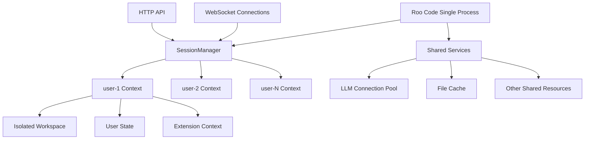

# Roo Code Extension Host 多用户架构设计方案

## 1. 系统架构图及组件说明

### 1.1 整体架构思路

将「用户」抽象为**会话上下文（Session Context）**，所有 VS Code API 调用都隐式携带当前用户 ID，在单进程内实现**软隔离**。

### 1.2 架构图



### 1.3 核心组件说明

#### 1.3.1 SessionManager

负责用户会话路由和鉴权，管理所有用户的 Session Context。

#### 1.3.2 Session Context

每个用户的独立上下文环境，包含工作区、用户状态和扩展上下文。

#### 1.3.3 Shared Services

共享服务层，提供 LLM 连接池、文件缓存等共享资源。

#### 1.3.4 API 代理层

对所有 VS Code API 进行用户级路由，确保 API 调用正确路由到当前用户的上下文。

## 2. SessionManager 的详细设计

### 2.1 功能概述

SessionManager 是系统的核心组件之一，负责管理所有用户的会话。主要功能包括：

- 用户会话管理（创建、销毁和维护 Session Context）
- 用户鉴权（验证用户身份）
- 消息路由（将请求正确路由到对应的用户上下文）
- 会话超时管理（自动清理不活跃的会话）

### 2.2 实现方案

```typescript
import { AsyncLocalStorage } from "async_hooks"

export const sessionStore = new AsyncLocalStorage<string>()

export function withUser<T>(uid: string, fn: () => T): T {
	return sessionStore.run(uid, fn)
}

// 获取当前用户 ID
export function getCurrentUserId(): string {
	const uid = sessionStore.getStore()
	if (!uid) throw new Error("No user context available")
	return uid
}
```

### 2.3 安全性设计

- 实现用户鉴权机制，确保只有经过验证的用户才能创建会话
- 防止会话固定攻击，定期更新会话标识
- 提供监控和日志功能，跟踪会话活动和诊断问题

## 3. VS Code API 代理层的详细设计

### 3.1 设计目标

对所有 VS Code API 进行用户级路由，确保在多用户环境下正确隔离不同用户的数据和状态。

### 3.2 核心改造点

#### 3.2.1 workspace.rootPath

返回用户专属路径 `sessions.get(uid).rootUri.fsPath`

#### 3.2.2 workspace.fs.\*

URI 前缀添加 `/users/{uid}` 实现虚拟隔离

#### 3.2.3 window.createTerminal

返回伪 Terminal 对象，使用 node-pty 并设置用户专属 cwd

#### 3.2.4 globalState/workspaceState

使用 keyv + SQLite，表名格式 `kv_${uid}`

#### 3.2.5 TextDocument 事件

URI 添加 `?uid=xxx` 查询参数，事件分发时过滤

#### 3.2.6 commands.registerCommand

命令 ID 自动添加 `__uid__` 前缀防止冲突

### 3.3 实现方案

```typescript
export const fs = {
	async readFile(uri: Uri): Promise<Uint8Array> {
		const uid = sessionStore.getStore()!
		const realPath = `/users/${uid}${uri.path}`
		return nodefs.readFile(realPath)
	},

	async writeFile(uri: Uri, content: Uint8Array): Promise<void> {
		const uid = sessionStore.getStore()!
		const realPath = `/users/${uid}${uri.path}`
		await ensureDir(path.dirname(realPath))
		return nodefs.writeFile(realPath, content)
	},
	// 其他文件操作同理
}
```

## 4. 数据隔离策略的详细设计

### 4.1 隔离维度

#### 4.1.1 文件系统隔离

统一根目录下 `/users/{uid}`，内部 URI rewrite

#### 4.1.2 内存隔离

每个 SessionContext 存储独立变量

#### 4.1.3 持久化隔离

每用户独立 SQLite 文件，路径：`users/{uid}/state.db`

### 4.2 安全边界

- 路径遍历防护：严格验证文件路径，防止用户访问其他用户目录
- 资源配额：为每个用户设置内存、CPU、存储配额
- 权限控制：基于用户 ID 的细粒度权限管理

### 4.3 实现细节

```typescript
// 文件路径隔离
function getUserPath(uid: string, relativePath: string): string {
	return path.join("/users", uid, relativePath)
}

// 状态存储隔离
function getUserStateDB(uid: string): string {
	return path.join("/users", uid, "state.db")
}

// 命令隔离
function getUserCommand(uid: string, command: string): string {
	return `${uid}__${command}`
}
```

## 5. 通信协议的详细设计

### 5.1 WebSocket 通信

每条消息携带 `uid` 字段，确保消息能正确路由到对应的用户上下文。

### 5.2 上下文传递

使用 AsyncLocalStorage 或 cls-hooked 隐式传递用户 ID。

### 5.3 消息路由

根据 `uid` 将消息路由到对应的 SessionContext。

### 5.4 消息格式

```json
{
	"uid": "user-id",
	"command": "command-name",
	"data": {}
}
```

## 6. 启动流程的详细设计

### 6.1 启动模式控制

通过环境变量 `MULTI_USER=1` 决定是否启用多用户模式。

### 6.2 启动命令

```bash
# 多用户模式
MULTI_USER=1 node dist/standalone.js

# 单用户模式（兼容模式）
node dist/standalone.js
```

### 6.3 启动脚本示例

```typescript
import express from "express"
import { WebSocket } from "ws"
import { activate } from "./src/extension"
import { withUser } from "./SessionManager"

const app = express()
const wss = new WebSocket.Server({ port: 3000 })
const sessions = new Map<string, any>()

wss.on("connection", (ws, req) => {
	const uid = new URL(req.url!, "http://dummy").searchParams.get("uid")!

	if (!sessions.has(uid)) {
		sessions.set(uid, createSessionContext(uid))
		withUser(uid, () => activate(sessions.get(uid)!))
	}

	ws.on("message", (msg) => {
		const data = JSON.parse(msg.toString())
		withUser(uid, () => handleMessage(data))
	})
})
```

### 6.4 实际实现

实际的启动脚本实现位于 `src/standalone.ts`，包含了完整的类型定义、错误处理和测试覆盖。
详细使用说明请参考 `src/README.multi-user.md`。

## 7. 与旧代码兼容性的详细设计

### 7.1 兼容性策略

- 保持原有代码结构：`src/` 目录完全不动
- Shim 层设计：所有多用户逻辑放在 `shim/multi-user-vscode.ts`
- 环境变量控制：通过 `MULTI_USER=1` 决定是否启用多用户模式

### 7.2 渐进式迁移

```typescript
// 环境变量控制
if (process.env.MULTI_USER === "1") {
	// 启用多用户模式
	initMultiUserMode()
} else {
	// 单用户模式，完全兼容原有逻辑
	initSingleUserMode()
}
```

### 7.3 测试兼容性

- 原有测试用例无需修改
- 单用户模式下行为完全一致
- 新增多用户专用测试套件

## 8. 性能优化和资源管理策略

### 8.1 资源共享优化

- 单进程架构，共享 LLM 连接池等资源
- 基于 Node.js 事件循环的天然并发能力

### 8.2 缓存策略

- 实现多级缓存机制（内存缓存、文件缓存、分布式缓存）
- 实现缓存失效机制，确保数据一致性

### 8.3 并发处理优化

- 充分利用 Node.js 事件循环机制
- 对于 CPU 密集型任务，使用 Worker Thread 处理
- 实现任务队列和优先级调度

### 8.4 资源配额管理

- 为每个用户设置资源配额（内存、CPU、存储）
- 实现配额监控和超限处理机制
- 提供配额调整功能

### 8.5 监控和调优

- 实现全面的性能监控
- 提供实时监控面板和历史数据分析
- 实现自动扩容和缩容机制
