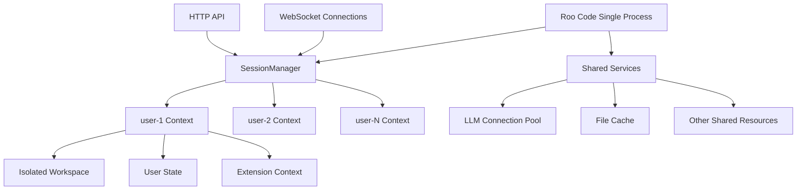

# Roo Code Extension Host 多用户架构设计分析

## 1. 开发的主要目标

### 核心目标

- **独立运行时**：Roo Code Extension Host 完全脱离 VS Code，以单进程 Node 服务形式启动
- **多用户并发支持**：一个进程必须同时服务 N 个用户，严格禁止多进程/多容器方案
- **完全隔离**：确保不同用户的工作区、状态、扩展上下文完全隔离
- **资源优化**：通过单进程架构实现资源共享（如 LLM 连接池），提高资源利用效率

### 设计约束

- 必须在单进程内实现多用户能力
- 不能依赖外部进程管理
- 需要保持与现有代码的兼容性

## 2. 核心思路和架构设计

### 2.1 整体架构思路

将「用户」抽象为**会话上下文（Session Context）**，所有 VS Code API 调用都隐式携带当前用户 ID，在单进程内实现**软隔离**。

### 2.2 架构图



### 2.3 核心组件

- **SessionManager**：负责用户会话路由和鉴权
- **Session Context**：每个用户的独立上下文环境
- **Shared Services**：共享服务层（LLM 池、文件缓存等）
- **API 代理层**：对所有 VS Code API 进行用户级路由

## 3. 需要实现的关键组件和功能

### 3.1 运行时入口改造

```typescript
// 原来：activate(context) 调用一次
// 改为：每用户一次，使用 SessionContext
const sessions = new Map<userId, SessionContext>()

// 用户首次连接时
if (!sessions.has(uid)) {
	sessions.set(uid, createSessionContext(uid))
	withUser(uid, () => activate(sessions.get(uid)!))
}
```

### 3.2 VS Code API 代理层

需要对以下关键 API 进行改造：

| API                          | 改造要点                                               |
| ---------------------------- | ------------------------------------------------------ |
| `workspace.rootPath`         | 返回用户专属路径 `sessions.get(uid).rootUri.fsPath`    |
| `workspace.fs.*`             | URI 前缀添加 `/users/{uid}` 实现虚拟隔离               |
| `window.createTerminal`      | 返回伪 Terminal 对象，使用 node-pty 并设置用户专属 cwd |
| `globalState/workspaceState` | 使用 keyv + SQLite，表名格式 `kv_${uid}`               |
| `TextDocument` 事件          | URI 添加 `?uid=xxx` 查询参数，事件分发时过滤           |
| `commands.registerCommand`   | 命令 ID 自动添加 `__uid__` 前缀防止冲突                |

### 3.3 SessionManager 实现

```typescript
import { AsyncLocalStorage } from "async_hooks"

export const sessionStore = new AsyncLocalStorage<string>()

export function withUser<T>(uid: string, fn: () => T): T {
	return sessionStore.run(uid, fn)
}

// 获取当前用户 ID
export function getCurrentUserId(): string {
	const uid = sessionStore.getStore()
	if (!uid) throw new Error("No user context available")
	return uid
}
```

### 3.4 文件系统代理

```typescript
export const fs = {
	async readFile(uri: Uri): Promise<Uint8Array> {
		const uid = sessionStore.getStore()!
		const realPath = `/users/${uid}${uri.path}`
		return nodefs.readFile(realPath)
	},

	async writeFile(uri: Uri, content: Uint8Array): Promise<void> {
		const uid = sessionStore.getStore()!
		const realPath = `/users/${uid}${uri.path}`
		await ensureDir(path.dirname(realPath))
		return nodefs.writeFile(realPath, content)
	},
	// 其他文件操作同理
}
```

### 3.5 通信协议

- **WebSocket**：每条消息携带 `uid` 字段
- **上下文传递**：使用 AsyncLocalStorage 或 cls-hooked 隐式传递用户 ID
- **消息路由**：根据 `uid` 将消息路由到对应的 SessionContext

## 4. 多用户隔离机制

### 4.1 隔离维度

| 维度         | 实现方案                                      | 备注                         |
| ------------ | --------------------------------------------- | ---------------------------- |
| **文件系统** | 统一根目录下 `/users/{uid}`，内部 URI rewrite | 无需 chroot，简单可靠        |
| **内存**     | 每个 SessionContext 存储独立变量              | 共用 LLM 连接池节省显存      |
| **CPU**      | Node 事件循环天然并发                         | 如需硬隔离可用 Worker Thread |
| **持久化**   | 每用户独立 SQLite 文件                        | 路径：`users/{uid}/state.db` |

### 4.2 隔离实现细节

```typescript
// 文件路径隔离
function getUserPath(uid: string, relativePath: string): string {
	return path.join("/users", uid, relativePath)
}

// 状态存储隔离
function getUserStateDB(uid: string): string {
	return path.join("/users", uid, "state.db")
}

// 命令隔离
function getUserCommand(uid: string, command: string): string {
	return `${uid}__${command}`
}
```

### 4.3 安全边界

- **路径遍历防护**：严格验证文件路径，防止用户访问其他用户目录
- **资源配额**：可为每个用户设置内存、CPU、存储配额
- **权限控制**：基于用户 ID 的细粒度权限管理

## 5. 与旧代码的兼容性保证

### 5.1 兼容性策略

- **保持原有代码结构**：`src/` 目录完全不动
- **Shim 层设计**：所有多用户逻辑放在 `shim/multi-user-vscode.ts`
- **环境变量控制**：通过 `MULTI_USER=1` 决定是否启用多用户模式

### 5.2 渐进式迁移

```typescript
// 环境变量控制
if (process.env.MULTI_USER === "1") {
	// 启用多用户模式
	initMultiUserMode()
} else {
	// 单用户模式，完全兼容原有逻辑
	initSingleUserMode()
}
```

### 5.3 测试兼容性

- 原有测试用例无需修改
- 单用户模式下行为完全一致
- 新增多用户专用测试套件

## 6. 部署和启动

### 6.1 启动命令

```bash
# 多用户模式
MULTI_USER=1 node dist/standalone.js

# 单用户模式（兼容模式）
node dist/standalone.js
```

### 6.2 配置示例

```typescript
// 启动脚本示例
import express from "express"
import { WebSocket } from "ws"
import { activate } from "./src/extension"
import { withUser } from "./SessionManager"

const app = express()
const wss = new WebSocket.Server({ port: 3000 })
const sessions = new Map<string, any>()

wss.on("connection", (ws, req) => {
	const uid = new URL(req.url!, "http://dummy").searchParams.get("uid")!

	if (!sessions.has(uid)) {
		sessions.set(uid, createSessionContext(uid))
		withUser(uid, () => activate(sessions.get(uid)!))
	}

	ws.on("message", (msg) => {
		const data = JSON.parse(msg.toString())
		withUser(uid, () => handleMessage(data))
	})
})
```

## 7. 总结

这个设计方案通过在**单进程内为每个用户维护独立的 SessionContext**，并对所有 VS Code API 进行**用户级路由、URI 重写和数据分表**，成功实现了**无多进程**的多用户并发 Roo Code Extension Host。

### 关键优势

1. **资源高效**：单进程架构，共享 LLM 连接池等资源
2. **完全隔离**：用户间工作区、状态、上下文完全隔离
3. **向后兼容**：通过环境变量控制，完全兼容现有代码
4. **易于部署**：一键启动，无需复杂的容器编排
5. **可扩展性**：基于 Node.js 事件循环的天然并发能力

这个架构为 Roo Code 的多用户部署提供了一个既高效又可靠的解决方案。
